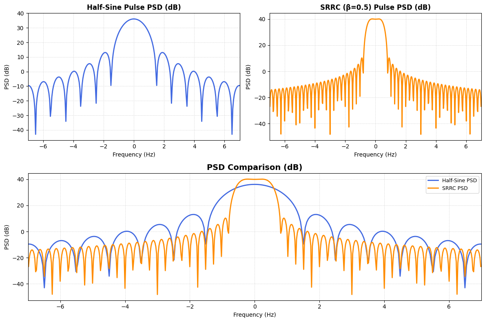
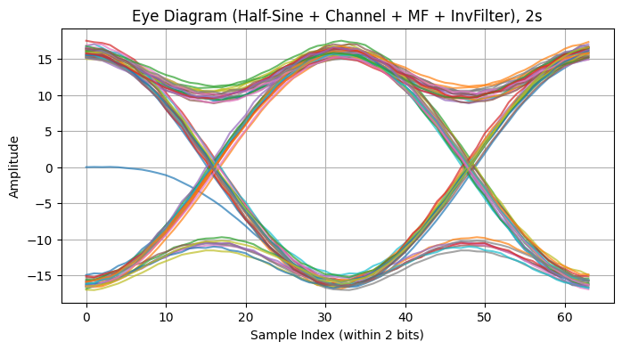

# Digital Communication System Simulation

A complete end-to-end digital communication system simulation in Python. This project models data transmission through an Additive White Gaussian Noise (AWGN) channel, implementing core digital signal processing techniques from source coding to equalization.

## System Architecture

*   **Image Pre-processing & Source Coding:** Reads an input grayscale image, divides it into 8x8 blocks, and applies a Discrete Cosine Transform (DCT) to each block. The DCT coefficients are scaled, quantized into 256 levels (8-bit representation), and flattened into a binary bitstream.
*   **Modulation & Pulse Shaping:** The bitstream is mapped using a polar line coding scheme. The system evaluates two pulse shaping filters: a Half-wave Sine pulse and a Square Root Raised Cosine (SRRC) pulse to control bandwidth and manage Inter-Symbol Interference (ISI).
*   **Channel Modeling:** Simulates an AWGN channel with a specific multi-path impulse response, incorporating zero-padding to match the system's sampling frequency (32 samples/bit). 
*   **Receiver & Matched Filter:** Implements a matched filter at the receiver end to maximize the Signal-to-Noise Ratio (SNR) before symbol detection.
*   **Equalization:** Applies both Zero-Forcing (ZF) and Minimum Mean Square Error (MMSE) equalizers to reverse channel distortion and mitigate ISI.

## System Evaluation & Results

### 1. Bandwidth vs. Pulse Shaping Trade-offs

Frequency response and Power Spectral Density (PSD) analysis demonstrated the fundamental trade-off in pulse shaping: while Half-Sine pulses offer wide eye-diagram openings, they consume significantly more bandwidth than SRRC pulses. 

### 2. Signal Recovery & Receiver Performance

Eye diagram visualizations confirm the effectiveness of the receiver design. Applying a matched filter followed by Zero-Forcing (ZF) equalization successfully inverted the channel frequency response, removed ISI, and maximized the decision margin. The ZF filter's susceptibility to noise amplification at deep fading frequencies highlights the necessity of the matched filter.

## Repository Structure

*   `Digital_Comm_Simulation.ipynb`: The main Jupyter Notebook containing the Python implementation for all communication blocks.
*   `input_transmission_image.jpg`: The original input image used to generate the transmitted bitstream.
*   `Digital_Communication_System_Report.pdf`: Comprehensive academic report detailing the mathematical formulations, impulse/frequency response plots, PSD comparisons, and eye diagrams generated during the simulation.

## Dependencies

*   `numpy`
*   `scipy.fftpack`
*   `opencv-python` (`cv2`)
*   `scikit-image` (`skimage`)
*   `matplotlib`
